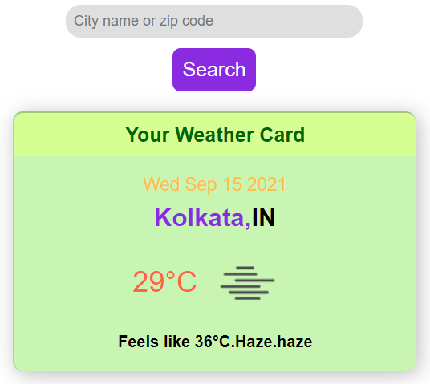
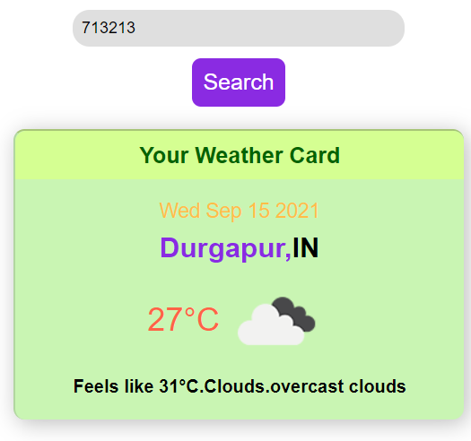
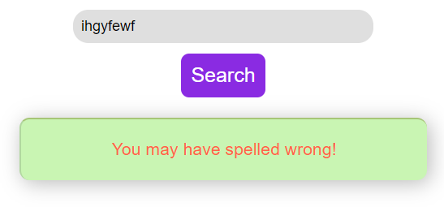
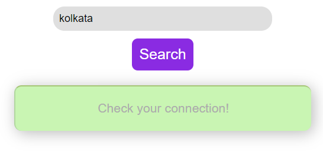

# can-I-go-to-shopping-today
Simply fetches weather data from openweather API and shows in an interesting manner.

I could not deploy it as it has an HTTP API call and github pages enforces HTTPS. However, I was learning about
working with data and APIs from Daniel Shiffman's youtube channel, The Coding Train. There I saw this API.
He did the basic stuff and gave a challenge of doing it in more interesting way. He is also obsessed with p5.js,
however, I like the library too, although I used jQuerry here because I've learnt jQuerry later that day and
wanted to have a good hands on into the library.

There is a short incident about my jQuerry learning. I heard about the library earlier but never got the enthu
to learn it. The day before I coded this, I saw the poster of an Web Development course of one of my brothers.
There he wrote he will teach jQuerry. And finally I got my enthu to learn it. Earlier I thought that what is the
need of jQuerry, I am pretty good with vanilla JavaScript. But after I coded this with jQuerry, now I don't want
to write vanilla JavaScript anymore xd. However, this is not an ad of jQuerry. I just liked it.

Here are some screenshots -

